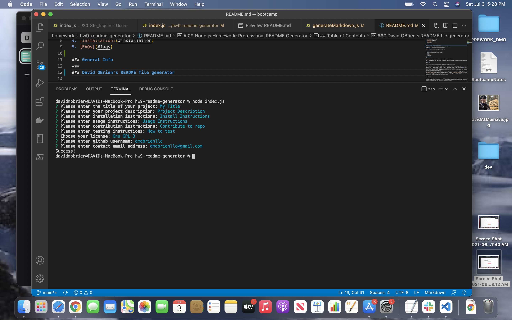

# hw9-readme-generator# 
# 09 Node.js Homework: Professional README Generator

## Table of Contents
1. [General Info](#general-info)
2. [Screenshot](#screenshot)
3. [Technologies](#technologies)
4. [Installation](#installation)
5. [FAQs](#faqs)

### General Info
***
### David OBrien's README file generator

inquirer (console) based application facilitating creation of custom
README files by capturing user input based on prompts.

### Screenshot

## Technologies
***
A list of technologies used within the project:
  * node
  * inquirer
  * markdown
  * javascript

## Installation
***

Link to github repository- https://github.com/dmobrienllc/hw9-readme-generator

Link to README generator demo video- https://drive.google.com/file/d/1q4qMHnaaQh-kqTuWAH4cncQpla-1oG8v/view?usp=sharing

## FAQs
***

Q Is this application awesome?

A Why yes it is!
---
